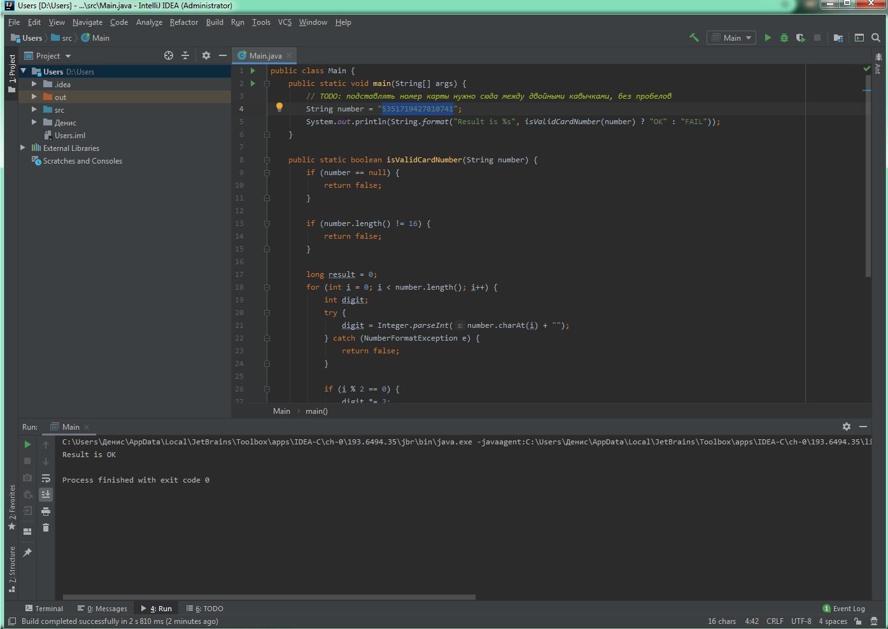

# Отчёт о тестировании 

## Краткое описание

11.03.2020 - 11.03.2020 было проведено Функциональное тестирование работы приложения Credit Card Number Validator

На тестирование затрачено: 1 час

В результате тестирования выявлены следующие дефекты:
* [Деффект 1](https://github.com/pldenn/java1/issues/1)
* [Деффект 2](https://github.com/pldenn/java1/issues/2)

## Описание процесса тестирования

В процессе тестирования использовались следующие артефакты*:
* [Руководство по установке IntelliJ IDEA](idea.md)
* Код программы [Credit Card Number Validator](artifacts/Main.java)

В качестве тестовых данных использовались данные :

#### Валидные ключи:

* 5351719427810741 
* 6351719427810741
* 351719427810741

Скриншот запуска

Тестирование производилось в следующем окружении:
* Windows 7 Профессиональная 64
* OpenJDK version 11.0.6
* IntelliJ IDEA 2019.3.3

